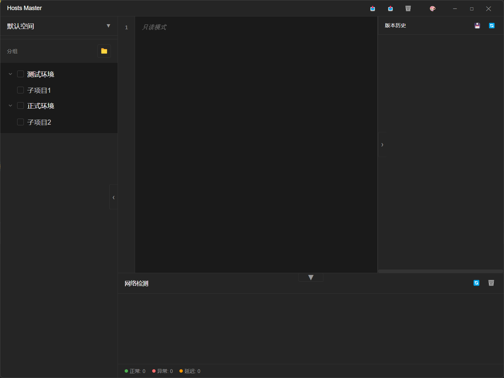

# Hosts Master 🚀

一个强大的跨平台 Hosts 文件管理工具,让开发调试更轻松! 


## 案例


## ✨ 特性

- 🌲 Git 风格的分支管理 - 轻松切换不同环境的 hosts 配置
- 🔄 智能同步 - 自动保存所有修改到本地 Git 仓库
- 🎯 快速切换 - 一键在开发、测试、生产环境间切换
- 👥 多工作空间 - 支持多个项目独立管理 hosts 配置
- 🔍 实时检测 - 自动检查 hosts 配置的可用性
- 🕒 版本历史 - 记录所有修改,随时可以回滚
- 🌐 远程同步 - 支持从远程仓库或 URL 同步 hosts 配置
- ⏰ 定时任务 - 设置定时自动切换不同的 hosts 配置
- 🎨 主题定制 - 支持明暗主题切换
- 💾 数据导入导出 - 支持 JSON/Excel/CSV 格式
- 🔒 安全可靠 - 所有数据存储在本地,无需担心隐私泄露

## 🎯 开源里程碑

### Phase 1 - 基础功能 (当前) 
- [x] Git 分支管理
- [x] 本地持久化
- [x] 基础编辑器
- [x] 系统托盘
- [ ] 完善单元测试
- [ ] 补充使用文档

### Phase 2 - 增强功能
- [ ] 远程仓库同步
- [ ] 团队协作功能
- [ ] 插件系统
- [ ] CI/CD 集成
- [ ] 国际化支持

### Phase 3 - 生态建设
- [ ] 官方网站
- [ ] 在线文档
- [ ] 插件市场
- [ ] 社区建设

## 🚀 快速开始

### 环境要求

- Node.js >= 14
- pnpm >= 6
- Git

### 开发

```bash
# 安装依赖
pnpm install

# 启动开发服务
pnpm electron:serve

# 打包
pnpm electron:build
```

### 项目结构

```
src/
├── components/          # Vue 组件
│   ├── HostsEditor     # hosts 编辑器
│   ├── HostsTree       # 分组树形结构
│   └── ...
├── services/           # 核心服务
│   ├── git.js         # Git 操作
│   ├── hosts.js       # Hosts 文件管理
│   └── ...
├── electron/          # Electron 主进程
└── App.vue           # 主界面
```

## 🤝 参与贡献

1. Fork 本仓库
2. 创建特性分支 (`git checkout -b feature/AmazingFeature`)
3. 提交改动 (`git commit -m 'Add some AmazingFeature'`)
4. 推送到分支 (`git push origin feature/AmazingFeature`)
5. 提交 Pull Request

## 📝 开源协议

本项目采用 [MIT](LICENSE) 协议开源。

## 🙏 鸣谢

- [Electron](https://www.electronjs.org/)
- [Vue.js](https://vuejs.org/)
- [electron-vue](https://github.com/SimulatedGREG/electron-vue)
- [Cursor](https://cursor.sh/) - AI 辅助编程工具,帮助加速开发

## 📧 联系我们

如有问题或建议,欢迎提 Issue 或 PR!


## 📈 Star 历史

[](https://star-history.com/#maskerprc/hosts-master&Date)
